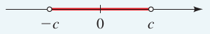
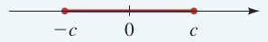
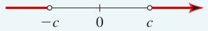
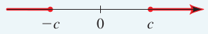

- Uma *inequação* é uma expressão matemática que envolve uma desigualdade entre duas expressões. Em vez de afirmar que duas expressões são iguais, uma inequação estabelece uma relação de maior que, menor que, maior ou igual a, ou menor ou igual a, entre essas expressões. #definição
- Alguns números satisfazem uma inequação, enquanto outros não.
	- | $x$ | $4x + 7 \leqslant 19$ | Valor verdade |
	  | --- | --- | --- |
	  | $1$ | $11 \leqslant 19$ | Verdadeiro |
	  | $2$ | $15 \leqslant 19$ | Verdadeiro |
	  | $3$ | $19 \leqslant 19$ | Verdadeiro |
	  | $4$ | $23 \leqslant 19$ | Falso |
	  | $5$ | $27 \leqslant 19$ | Falso |
- Inequações geralmente tem infinitas soluções.
	- |Equação/Inequação|Solução|Gráfico|
	  |--|--|--|
	  |$4x + 7 = 19$|$x = 3$|  |
	  |$4x + 7 \leqslant 19$|$x \leqslant 3$|  |
- Regras de equivalência
	- $A \leqslant B \Leftrightarrow A + C \leqslant B + C$ #propriedade
		- Adicionar a mesma quantidade a cada lado de uma inequação produz uma inequação equivalente.
	- $A \leqslant B \Leftrightarrow A - C \leqslant B - C$ #propriedade
		- Subtrair a mesma quantidade de cada lado de uma inequação produz uma inequação equivalente.
	- $\text{Se } C \gt 0 \text{, então } A \leqslant B \Leftrightarrow CA \leqslant CB$ #propriedade
		- Multiplicar cada lado de uma inequação pela mesmo número positivo produz uma inequação equivalente.
	- $\text{Se } C \lt 0 \text{, então } A \leqslant B \Leftrightarrow CA \geqslant CB$ #propriedade
		- Multiplicar cada lado de uma inequação pelo mesmo número negativo *inverte a direção* da inequação.
	- $\text{Se } A \gt 0  \text{ e } B \gt 0 \text{, então } A \leqslant B \Leftrightarrow \tfrac{1}{A} \geqslant \tfrac{1}{B}$ #propriedade
		- Tomar os recíprocos de ambos os lados de uma inequação envolvendo quantidades positivas *inverte a direção* da inequação.
	- $\text{Se } A \leqslant B \text{ e } B \leqslant C \text{, então } A \leqslant C$ #propriedade
		- Inequações são transitivas.
- Resolvendo inequações lineares #seção
	- Uma inequação é *linear* se cada termo é constante ou múltiplo de uma variável.
	- Resolva a inequação $3x \lt 9x + 4$. #exemplo
		- $$
		  \begin{align*}
		  3x & \lt 9x + 4 & \quad & \text{Inequação original} \\
		  3x - 9x & \lt 9x + 4 - 9x & \quad & \text{Subtrair } 9x \\
		  -6x & \lt 4 & \quad & \text{Simplificar} \\
		  \left( -\tfrac{1}{6} \right) \left( -6x \right) & \gt \left( -\tfrac{1}{6} \right) \left( 4 \right) & \quad & \text{Multiplicar por } -\tfrac{1}{6} \text{ e inverter a inequação} \\
		  x & \gt -\tfrac{2}{3} & \quad & \text{Simplificar}
		  \end{align*}
		  $$
		- O conjunto solução é $\{ x \mid 2 \leqslant x \lt 5 \} = [2,5)$.
- Resolvendo inequações não lineares #seção
	- O sinal de um produto ou quociente
		- Se um produto ou quociente tem um número *par* de fatores *negativos*, então o seu valor é *positivo*.
		- Se um produto ou quociente tem um número *ímpar* de fatores *negativos*, então o seu valor é *negativo*.
	- Diretrizes para resolver inequações não lineares
		- Mover todos os termos para um dos lados da inequação e simplificar.
		  logseq.order-list-type:: number
		- Fatorar o lado não zero da inequação.
		  logseq.order-list-type:: number
		- Determinar os intervalos.
		  logseq.order-list-type:: number
		- Descobrir o sinal dos fatores e do produto ou quociente em cada intervalo.
		  logseq.order-list-type:: number
		- Identificar os intervalos que satisfazem a inequação e verificar os extremos.
		  logseq.order-list-type:: number
	- Resolva a inequação $x² \leqslant 5x - 6$. #exemplo
		- Mover todos os termos para um dos lados da inequação e simplificar.
		  logseq.order-list-type:: number
			- $x^2 - 5x + 6 \leqslant 0 \\$
			  logseq.order-list-type:: number
		- Fatorar o lado não zero da inequação.
		  logseq.order-list-type:: number
			- $(x - 2)(x - 3) \leqslant 0$
			  logseq.order-list-type:: number
		- Determinar os intervalos.
		  logseq.order-list-type:: number
			- Os fatores $x - 2$ e $x - 3$ são iguais a zero quando $x$ é igual a $2$ e $3$, respectivamente.
			  logseq.order-list-type:: number
			- Logo, dividimos a reta real em três intervalos:
			  logseq.order-list-type:: number
				- $(-\infty, 2)$
				  logseq.order-list-type:: number
				- $(2, 3)$
				  logseq.order-list-type:: number
				- $(3, \infty)$.
				  logseq.order-list-type:: number
		- Descobrir o sinal dos fatores e do produto em cada intervalo.
		  logseq.order-list-type:: number
			- logseq.order-list-type:: number
			  |Intervalo/Fator|$(-\infty, 2)$|$(2, 3)$|(3, \infty)|
			  |--|--|--|--|
			  |$x - 2$|$-$|$+$|$+$|
			  |$x - 3$|$-$|$-$|$+$|
			  |$(x - 2)(x - 3)$|$+$|$-$|$+$|
		- Identificar os intervalos que satisfazem a inequação e verificar os extremos.
		  logseq.order-list-type:: number
			- O intervalo $(2, 3)$ satisfaz a inequação, incluindo os extremos $2$ e $3$.
			  logseq.order-list-type:: number
		- O conjunto solução é $\{ x \mid 2 \leqslant x \leqslant 3 \} = [2, 3]$
		  logseq.order-list-type:: number
	- Resolva a inequação $\dfrac{1 + x}{1 - x} \geqslant 1$ #exemplo
		- Mover todos os termos para um dos lados da inequação e simplificar.
		  logseq.order-list-type:: number
			- $\dfrac{2x}{1 - x} \geqslant 0$
			  logseq.order-list-type:: number
				- Normalmente poderiamos simplesmente multiplicar os dois lados por $1 - x$, mas não podemos fazer isso com uma inequação porque não sabemos se $1 - x$ é positivo ou negativo. Logo, também não é possível saber se devemos ou não inverter o sinal da inequação. #atenção
				  logseq.order-list-type:: number
		- Determinar os intervalos.
		  logseq.order-list-type:: number
			- Os fatores $2x$ e $1 - x$ são iguais a zero quando $x$ e igual a $0$ e $1$, respectivamente.
			  logseq.order-list-type:: number
			- Logo, dividimos a reta real em três intervalos:
			  logseq.order-list-type:: number
				- $(-\infty, 0)$
				  logseq.order-list-type:: number
				- $(0, 1)$
				  logseq.order-list-type:: number
				- $(1, \infty)$
				  logseq.order-list-type:: number
		- Descobrir o sinal dos fatores e do quociente em cada intervalo.
		  logseq.order-list-type:: number
			- logseq.order-list-type:: number
			  |Intervalo/Fator|$(-\infty, 2)$|$(2, 3)$|(3, \infty)|
			  |--|--|--|--|
			  |$2x$|$-$|$+$|$+$|
			  |$1 - x$|$+$|$+$|$-$|
			  |$\dfrac{2x}{1 - x}$|$-$|$+$|$-$|
		- Identificar os intervalos que satisfazem a inequação e verificar os extremos.
		  logseq.order-list-type:: number
			- O intervalo $(0, 1)$ satisfaz a inequação.
			  logseq.order-list-type:: number
			- O extremo $0$ satisfaz a inequação.
			  logseq.order-list-type:: number
			- O extremo $1$ não satisfaz a inequação porque o quociente na inequação é indefinido quando $x = 1$.
			  logseq.order-list-type:: number
		- O conjunto solução é $\{x \mid 0 \leqslant x \lt 1 \} = [0, 1)$.
		  logseq.order-list-type:: number
- Inequações de valor absoluto #seção
	- A solução de uma inequação de valor absoluto inclui números positivos e negativos.
	- Propriedades das inequações de valor absoluto
		- $\lvert x \rvert \lt c \Leftrightarrow -c \lt x \lt c$ #propriedade
			- 
		- $\lvert x \rvert \leqslant c \Leftrightarrow -c \leqslant x \leqslant c$ #propriedade
			- 
		- $\lvert x \rvert \gt c \Leftrightarrow x \lt -c \enspace \text{ou} \enspace c \lt x$ #propriedade
			- 
		- $\lvert x \rvert \geqslant c \Leftrightarrow x \leqslant -c \enspace \text{ou} \enspace c \leqslant x$ #propriedade
			- 
	- Resolva a inequação $\lvert x - 5 \rvert \lt 2$. #exemplo
		- $$
		  \begin{align*}
		  -2 & \lt x - 5 \lt 2 \\
		  3 & \lt x \lt 7
		  \end{align*}
		  $$
		- O conjunto solução é $\{ x \mid 3 \lt x \lt 7 \} = (3, 7)$.
	- Resolva a inequação $\lvert 3x + 2 \rvert \geqslant 4$. #exemplo
		- $$
		  \begin{align*}
		  3x + 2 & \geqslant 4 \quad & \text{ou} \quad 3x + 2 & \leqslant -4 \\
		  3x & \geqslant 2 \quad & \quad 3x & \leqslant -6 \\
		  x & \geqslant \tfrac{2}{3} \quad & \quad x & \leqslant -2
		  \end{align*}
		  $$
		- O conjunto solução é $\{ x \mid x \leqslant -2 \enspace \text{ou} x \geqslant \tfrac{2}{3} \} = (-\infty, 2] \cup [\tfrac{2}{3}, \infty)$.
- Modelando com inequações #seção