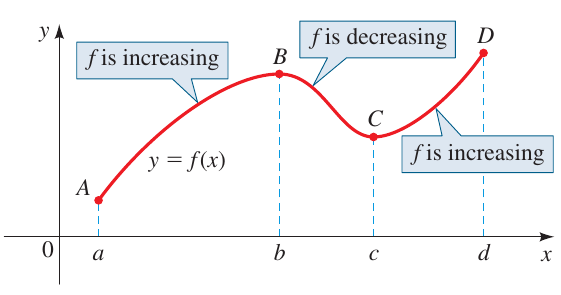

capítulo:: [[2. Funções]]

- Valores de uma função; Domínio e conjunto imagem
  parte:: seção
- Comparando valores de funções: resolvendo equações e inequações graficamente
  parte:: seção
- Funções crescentes e decrescentes
  parte:: seção
	- O gráfico abaixo sobe de $A$ a $B$, desce de $B$ a $C$, e sobe novamente de $C$ a $D$. A função $f$ é considerada *crescente* quando o seu gráfico sobe e *decrescente* quando o seu gráfico desce.
	  
	  
	- Função crescente
	  matemática/tipo:: definição
		- Uma função $f$ é **crescente** em um intervalo $I$ se $f(x_1) \lt f(x_2)$ sempre que $x_1 \lt x_2$ em $I$.
		  matemática/tipo:: definição
	- Função decrescente
		- Uma função $f$ é **decrescente** em um intervalo $I$ se $f(x_1) \gt f(x_2)$ sempre que $x_1 \lt x_2$ em $I$.
		  matemática/tipo:: definição
- Máximos e mínimos locais de uma função
  parte:: seção
	- Máximo local
	  matemática/tipo:: definição
		- O valor $f(a)$ de uma função $f$ é o **máximo local** de $f$ se
		  
		  $$
		  f(a) \geqslant f(x) \quad \text{quando } x \text{ está próximo de } a
		  $$
		  
		  Isso significa que $f(a) \geqslant f(x)$ para todo $x$ em um intervalo aberto incluindo $a$. Nesse caso dizemos que $f$ tem um **máximo local** em $x = a$.
		  
		  matemática/tipo:: definição
	- Mínimo local
	  matemática/tipo:: definição
		- O valor $f(a)$ de uma função $f$ é o **mínimo local** de $f$ se
		  
		  $$
		  f(a) \leqslant f(x) \quad \text{quando } x \text{ está próximo de } a
		  $$
		  
		  Isso significa que $f(a) \leqslant f(x)$ para todo $x$ em um intervalo aberto incluindo $a$. Nesse caso dizemos que $f$ tem um **mínimo local** em $x = a$.
		  
		  matemática/tipo:: definição