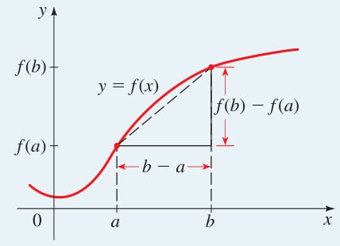
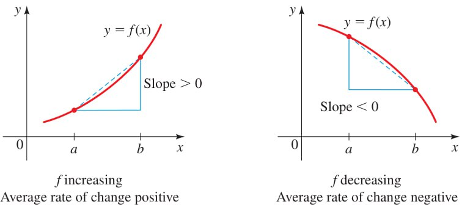

capítulo:: [[2. Funções]]

- Taxa média de variação
  parte:: seção
	- Taxa média de variação
	  matemática/tipo:: definição
		- A **taxa média de variação** de uma função $y = f(x)$ entre $x = a$ e $x = b$ é
		  
		  $$
		  \dfrac{f(b) - f(a)}{b - a}
		  $$
	- A taxa média de variação é a inclinação da reta secante entre $x = a$ e $x = b$ no gráfico de $f$, ou seja, a reta que passa por $(a, f(a))$ e $(b, f(b))$.
	  
	  
	- Se uma função é crescente em um intervalo, então a taxa média de variação entre dois pontos quaisquer nesse intervalo é positiva, enquanto que se uma função é decrescente em um intervalo, então a taxa média de variação entre quaisquer dois pontos nesse intervalo é negativa.
	  
	  
- Funções lineares tem uma taxa média de variação constante
  parte:: seção