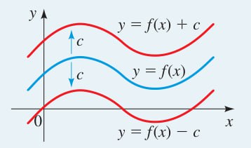
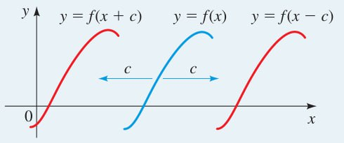
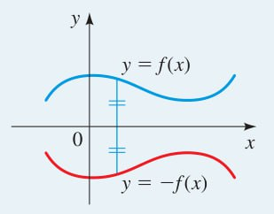
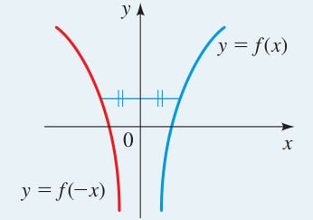
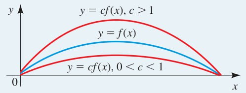
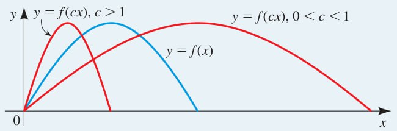
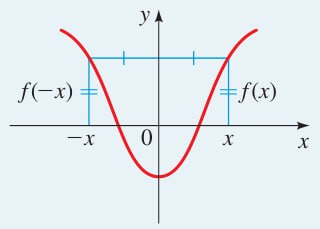
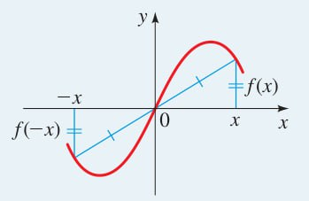

projeto:: [[Precalculus: Mathematics for Calculus]]
livro/capítulo:: [[2. Funções]]

- Deslocamento vertical
  parte:: seção
  collapsed:: true
	- Para obter o gráfico de $y = f(x) + c$, desloque o gráfico de $y = f(x)$ para cima por $c$ unidades (com $c > 0$).
	  matemática/tipo:: regra
	- Para obter o gráfico de $y = f(x) - c$, desloque o gráfico de $y = f(x)$ para baixo por $c$ unidades (com $c > 0$).
	  matemática/tipo:: regra
	- 
- Deslocamento horizontal
  parte:: seção
  collapsed:: true
	- Para obter o gráfico de $y = f(x - c)$, desloque o gráfico de $y = f(x) para a direita por $c$ unidades (com $c > 0$).
	  matemática/tipo:: regra
	- Para obter o gráfico de $y = f(x + c)$, desloque o gráfico de $y = f(x) para a esquerda por $c$ unidades (com $c > 0$).
	  matemática/tipo:: regra
	- 
- Reflexão de gráficos
  parte:: seção
  collapsed:: true
	- Para obter o gráfico de $y = -f(x)$, reflita o gráfico de $y = f(x)$ em relação ao eixo $x$.
	  matemática/tipo:: regra
		- 
	- Para obter o gráfico de $y = f(-x)$, reflita o gráfico de $y = f(x)$ em relação ao eixo $y$.
	  matemática/tipo:: regra
		- 
- Alongamento e compressão vertical
  parte:: seção
  collapsed:: true
	- Para obter o gráfico de $y = cf(x)$:
	  matemática/tipo:: regra
		- Se $c > 1$, alongue o gráfico de $y = f(x)$ verticalmente por um fator de $c$.
		- Se $0 < c < 1$, comprima o gráfico de $y = f(x)$ verticalmente por um fator de $c$.
	- 
- Alongamento e compressão horizontal
  parte:: seção
  collapsed:: true
	- Para obter o gráfico de $y = f(cx)$:
	  matemática/tipo:: regra
		- Se $c > 1$, comprima o gráfico de $y = f(x)$ horizontalmente por um fator de $\dfrac{1}{c}$.
		- Se $0 < c < 1$, alongue o gráfico de $y = f(x)$ horizontalmente por um fator de $\dfrac{1}{c}$.
	- 
- Funções pares e ímpares
  parte:: seção
  collapsed:: true
	- Uma função $f$ é **par** se $f(-x) = f(x)$ para todo $x$ no domínio de $f$.
	  matemática/tipo:: regra
		- 
	- Uma função $f$ é **ímpar** se $f(-x) = -f(x)$ para todo $x$ no domínio de $f$.
	  matemática/tipo:: regra
		- 