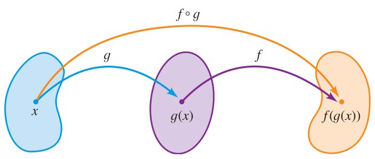

projeto:: [[Precalculus: Mathematics for Calculus]]
livro/capítulo:: [[2. Funções]]

- Somas, diferenças, produtos e quocientes
  parte:: seção
	- Consideremos duas funções $f$ e $g$ com domínios $A$ e $B$, respectivamente. Então:
		- $(f + g)(x) = f(x) + g(x)$
			- Domínio: $A \cap B$
		- $(f - g)(x) = f(x) - g(x)$
			- Domínio: $A \cap B$
		- $(fg)(x) = f(x)g(x)$
			- Domínio: $A \cap B$
		- $\left( \dfrac{f}{g} \right) = \dfrac{f(x)}{g(x)}$
			- Domínio: $\{ x \in A \cap B \mid g(x) \neq 0 \}$
- Composição de funções
  parte:: seção
	- Função composta
	  matemática/tipo:: definição
		- Dadas duas funções $f$ e $g$, a **função composta** $f \circ g$ é definida por
		  
		  $$
		  (f \circ g)(x) = f(g(x))
		  $$
	- O domínio da função $f \circ g$ é o conjunto de todo $x$ no domínio de $g$ tal que $g(x)$ está no domínio de $f$. Em outras palavras, $(f \circ g)(x)$ está definida quando ambos $g(x)$ e $f(g(x))$ estão definidos.
	  
- Aplicações da composição
  parte:: seção